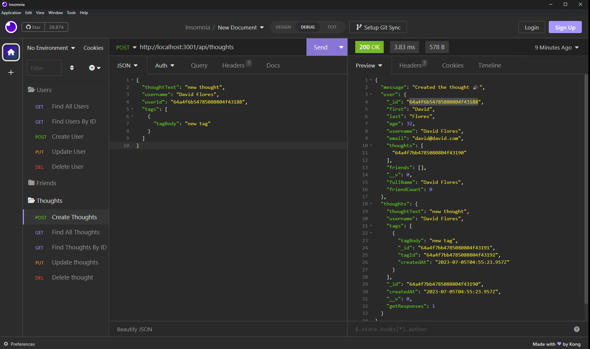

# David's Social-Network-API
>In the following project we provide a social network API using MongoDB Compass as the database.

## Table of Contents
1. [MongoDB Connection](#mongodb-connection)
2. [User Route Testing](#user-route-testing)
3. [Thoughts Route Testing](#thoughts-route-testing)
4. [Friends Route Testing](#friends-route-testing)
5. [Reactions Route Testing](#reactions-route-testing)

## MongoDB Connection
>[Please click here to view MongoDB connection demonstration](https://drive.google.com/file/d/1f_ZOwD_wWVan8r1XjtgjnAE23aD1srjc/view)

## User Route Testing
>[Please click here to view "Users" route testing in Insomnia](https://drive.google.com/file/d/1ozOpy1ZCt31dXxiQNEzMxm07FM89-YoI/view)

## Thoughts Route Testing
>[Please click here to view "Thoughts" route testing in Insomnia](https://drive.google.com/file/d/1rmLo6PTG3miNV063VRaUjlcCgJK2gjms/view)

## Friends Route Testing
>[Please click here to view "Friends" route testing in Insomnia](https://drive.google.com/file/d/15K2LxTbRsqJnOqNM_fp7TtEdYK1W7bCB/view)

## Reactions Route Testing
>[Please click here to view "Reaction" route testing in Insomnia](https://drive.google.com/file/d/1B9-wlIez04C0Xh5MLR4eyUQLrTn4Lu7g/view)

